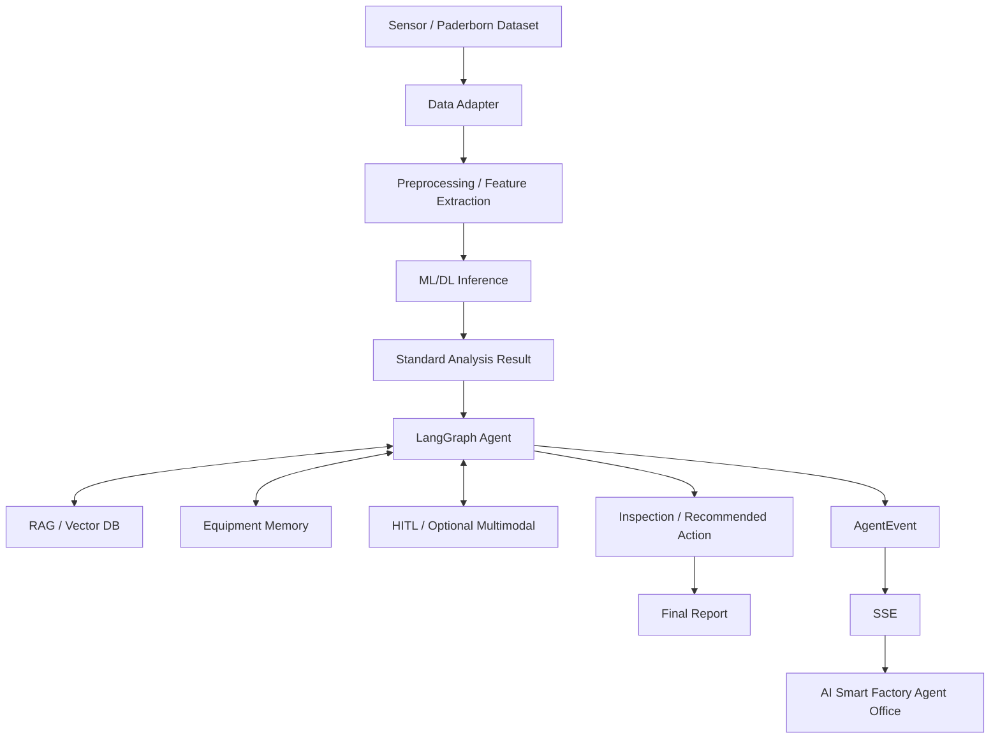

# AI Smart Factory Agent Office
> 제조설비 센서 데이터를 ML/DL로 분석하고, RAG 기술문서와 LangGraph 기반 AI Agent가 근거 기반 진단·점검·조치안을 생성하며, 전체 과정을 Agent Office에서 실시간으로 시각화하는 AI Native 제조설비 진단 서비스

> **문서 상태:** 제출용 README 초안 / 설계 기준 v0.1  
> **현재 상태:** 전체 설계 및 Codex STEP 01~15 작업지시서 작성 완료, 단계별 구현·검증 진행 중  
> **주의:** 아래의 `🟨 구현 후 입력`, `🟧 사용자 결정 필요` 항목은 실제 결과가 확정된 뒤 반드시 갱신합니다.

---

## 작성 표시 안내

- ✅ **AI 작성 완료**: 현재 설계 문서와 과제 요구사항으로 채울 수 있는 내용
- 🟨 **구현 후 입력**: 실제 구현·테스트·배포 결과가 있어야 채울 수 있는 내용
- 🟧 **사용자 결정 필요**: 팀 회의, 참가 분야, 기술 선택 등 사람의 결정이 필요한 내용
- ⭐ **권장**: 과제 필수 수준을 넘지만 완성도·평가·발표에 도움이 되는 내용

---

# 1. 프로젝트 개요 ✅

**힌트:** 이 프로젝트가 “무엇을, 누구를 위해, 어떤 AI 방식으로 해결하는지” 3~5문장으로 적습니다.

## 1.1 프로젝트명

**AI Smart Factory Agent Office**

## 1.2 한 줄 소개

산업설비의 센서 데이터를 ML/DL로 분석하여 이상을 탐지하고, RAG 기반 기술문서 검색과 LangGraph 기반 AI Agent가 원인 후보·점검 순서·조치안을 제시하며, 전체 과정을 AI Smart Factory Agent Office에서 실시간으로 시각화하는 제조설비 진단 플랫폼입니다.

## 1.3 프로젝트 유형

- AI Native Final Project
- 제조설비 이상탐지·고장진단 AI Agent
- End-to-End MVP 우선 개발
- 기준 데이터: **Paderborn University Bearing DataCenter**
- Knowledge Base: 베어링·진동진단·손상·점검·정비 기술자료

## 1.4 프로젝트 상태

현재는 최종 확정본이 아니라 **v0.1 설계 기준안**을 바탕으로 구현과 검증을 진행하고 있습니다.

개발 방식은 다음 원칙을 따릅니다.

```text
전체 설계
→ 단계별 작업지시서
→ 구현
→ 단계별 검증
→ 사용자 피드백
→ 개선
→ 최종 배포·발표
```

---

# 2. 문제 정의 ✅

**힌트:** 사용자가 실제로 겪는 문제와 기존 방식의 한계를 적습니다. “AI를 쓰고 싶다”가 아니라 “어떤 문제를 해결하는가”가 중심입니다.

제조 현장에서는 진동, 전류, 온도, 회전속도 등 다양한 센서 데이터가 지속적으로 발생하지만, 센서값만으로 설비 상태와 고장 원인을 바로 판단하기 어렵습니다.

본 프로젝트는 다음 질문에 답하는 것을 목표로 합니다.

- 어떤 설비에서 이상이 발생했는가?
- 정상 상태와 얼마나 다른가?
- 어떤 고장 가능성이 있는가?
- 판단의 기술적 근거는 무엇인가?
- 무엇을 추가로 점검해야 하는가?
- 어떤 순서로 조치해야 하는가?
- 과거에도 비슷한 문제가 있었는가?

단순한 이상탐지 Dashboard에서 끝나는 것이 아니라, **센서 분석 결과를 기술문서 근거와 연결하고 Agent가 진단·검증·점검·조치까지 이어가는 흐름**을 구현합니다.

---

# 3. 대상 사용자 🟧

**힌트:** 실제 서비스를 사용할 사람을 1~3개 그룹으로 정하고, 각 사용자가 무엇을 필요로 하는지 적습니다.

### 현재 설계상 예상 사용자

- 제조설비 유지보수·정비 담당자
- 설비 상태를 모니터링하는 생산/설비 관리자
- AI 기반 설비진단 결과를 검토하는 엔지니어

### 최종 확정 필요

- **주 사용자:** `[사용자 결정 필요]`
- **부 사용자:** `[사용자 결정 필요]`
- **실제 사용자 테스트 대상:** `[최소 5명 이상 / 구현 후 입력]`

---

# 4. 해결 방법 및 핵심 가치 ✅

**힌트:** 문제를 어떤 순서로 해결하는지 흐름으로 설명합니다.

```text
Sensor Dataset
→ Data Adapter
→ Preprocessing / Feature Extraction
→ ML/DL Detection
→ Standard Analysis Result
→ LangGraph Agent
→ RAG Technical Evidence
→ Diagnosis & Evidence Verification
→ Conditional Retry / HITL
→ Inspection Plan
→ Recommended Action
→ Final Report
→ AgentEvent / SSE
→ AI Smart Factory Agent Office
```

### 핵심 차별점

```text
단순 Chatbot
X

단순 이상탐지 Dashboard
X

Sensor Detection
→ Evidence Retrieval
→ Agentic Diagnosis
→ Evidence Verification
→ Human Collaboration
→ Inspection / Action
→ Memory
O
```

본 프로젝트의 목표는 “AI가 고장을 맞히는 시스템”만 만드는 것이 아닙니다.

> 센서 이상탐지 결과를 기술문서 근거와 설비 이력으로 검증하고, 근거가 부족하면 추가 검색 또는 사람에게 정보를 요청하며, 점검과 조치까지 연결하는 AI Agent 시스템을 구현합니다.

---

# 5. 핵심 End-to-End 시나리오 ✅

**힌트:** 심사자나 사용자가 처음부터 끝까지 실제로 볼 수 있는 “대표 시나리오 1개”를 적습니다.

1. 사용자가 테스트 설비/센서 데이터를 선택합니다.
2. ML/DL 모델이 센서 데이터를 분석합니다.
3. 정상/이상 상태와 고장 가능성을 구조화된 결과로 반환합니다.
4. 이상 상태이면 LangGraph 진단 Workflow가 시작됩니다.
5. RAG가 관련 기술문서와 손상·점검 자료를 검색합니다.
6. Agent가 ML/DL 결과와 RAG 근거를 결합합니다.
7. 근거가 부족하면 Query를 보완해 추가 검색합니다.
8. 필요하면 Human-in-the-loop로 현장정보 또는 확인을 요청합니다.
9. 가능한 원인 후보와 추가 점검 항목을 생성합니다.
10. 위험한 자동 제어 대신 **권장 점검·조치안**을 생성합니다.
11. 출처와 한계가 포함된 최종 Report를 생성합니다.
12. 실제 Backend Event가 SSE를 통해 Agent Office에 실시간으로 표시됩니다.

---

# 6. 기능 요구사항 ✅ / 🟨

**힌트:** “무엇을 할 수 있어야 하는가”를 Must/Should/Could로 구분합니다. 실제 구현 여부는 제출 직전에 갱신합니다.

| ID | 기능 | 설명 | 우선순위 | 현재 상태 |
|---|---|---|---|---|
| FR-01 | 센서 데이터 입력/선택 | Paderborn 또는 Adapter 기반 측정 데이터를 선택·로딩 | Must | 🟨 |
| FR-02 | ML/DL 이상탐지 | 정상/손상 또는 고장 상태 분석 | Must | 🟨 |
| FR-03 | Standard Analysis Result | 모델 결과를 공통 Schema로 변환 | Must | 🟨 |
| FR-04 | RAG 기술문서 검색 | 진단에 필요한 기술근거와 출처 검색 | Must | 🟨 |
| FR-05 | LangGraph Agent Workflow | 분석→검색→진단→검증→조치 흐름 관리 | Must | 🟨 |
| FR-06 | 조건분기/재검색 | 근거 부족·상충 시 Query 보완 및 Retry | Must | 🟨 |
| FR-07 | 근거 기반 진단 | 원인 후보와 Evidence를 연결 | Must | 🟨 |
| FR-08 | Inspection Plan | 추가 점검 항목과 순서 생성 | Must | 🟨 |
| FR-09 | Recommended Action | monitor/inspect/schedule maintenance/expert review 등 권고 | Must | 🟨 |
| FR-10 | Final Report | ML 결과, 진단, 근거, 점검, 조치, 한계 포함 | Must | 🟨 |
| FR-11 | Agent Office | 실제 AgentEvent를 기반으로 Workflow 상태 시각화 | Must | 🟨 |
| FR-12 | SSE 실시간 상태 | Backend 상태를 Frontend에 실시간 전달 | Must | 🟨 |
| FR-13 | Human-in-the-loop | 근거 부족·고위험 조치·추가 현장정보 요청 | Should | 🟨 |
| FR-14 | Long-term Equipment Memory | 과거 진단·점검·정비 이력을 다음 진단에 활용 | Should | 🟨 |
| FR-15 | Multimodal Inspection | 이미지 기반 관찰정보를 보조 Context로 사용 | Could | 🟨 |
| FR-16 | 자동 알림 | 중요 Event/진단 결과 알림 | Could | 🟨 |

> **과제 필수 기술요소 2개 이상 충족 계획:** AI Agent + RAG를 필수 축으로 사용하며, Automation Workflow, Long-term Memory, Multimodal은 고도화 기능으로 설계합니다.

---

# 7. 비기능 요구사항 🟨

**힌트:** 속도, 안정성, 보안, 추적성, 접근성처럼 “기능 외 품질 기준”을 적습니다.

| ID | 항목 | 요구사항 | 최종 기준 |
|---|---|---|---|
| NFR-01 | 외부 접근 | 브라우저에서 서비스 접근 가능 | 🟨 배포 URL 입력 |
| NFR-02 | 추적성 | run_id 기준 Agent 실행과 Evidence 추적 가능 | 🟨 |
| NFR-03 | Citation | 실제 Evidence Metadata 기반 출처 표시 | 🟨 |
| NFR-04 | Ground Truth 격리 | 평가용 정답정보가 Runtime Agent Context에 유입되지 않음 | 🟨 |
| NFR-05 | 안전성 | PLC 직접 제어·무승인 고위험 자동조치 금지 | ✅ 설계 확정 |
| NFR-06 | 개인정보 | 사용자 테스트·이미지·Memory의 개인정보 최소수집 | 🟨 |
| NFR-07 | Error 처리 | Data/Model/RAG/LLM/DB/SSE 오류를 구분 | 🟨 |
| NFR-08 | 재현성 | Dataset/Model/Knowledge Pack Version 추적 | 🟨 |
| NFR-09 | 접근성 | 키보드/텍스트/상태표시 등 기본 접근성 고려 | 🟨 |
| NFR-10 | 성능 | API/LLM/RAG/Agent Latency 기록 | 🟨 실제 수치 입력 |

---

# 8. 시스템 아키텍처 ✅

**힌트:** Frontend, Backend, ML/DL, RAG, LangGraph, DB가 어떻게 연결되는지 한 장으로 보여줍니다.



### 설계 원칙

- 데이터셋별 로직은 `Data Adapter`에 격리합니다.
- 모든 ML/DL 모델은 공통 `Standard Analysis Result`를 반환합니다.
- RAG Ingestion/Retrieval/Evidence를 Agent Logic과 분리합니다.
- Workflow 분기와 State 관리는 LangGraph가 담당합니다.
- Agent Office는 가짜 Timer가 아니라 실제 Backend Event를 반영합니다.
- Citation은 LLM이 임의 생성하지 않고 Evidence Metadata에서 만듭니다.

---

# 9. AI Native 구성요소 ✅ / 🟨

**힌트:** 기술명을 나열하지 말고 “이 서비스에서 그 기술이 왜 필요한가”를 설명합니다.

## 9.1 AI Agent / LangGraph

LangGraph는 전체 진단 과정의 Orchestrator입니다.

```text
ML/DL = Detect
RAG   = Retrieve / Ground
Agent = Reason / Coordinate / Recommend
```

초기 구현은 복잡한 Multi-Agent보다 **One LangGraph + Role-based Nodes** 구조를 사용합니다.

주요 Node:

- `initialize_run`
- `load_sensor_data`
- `run_detection`
- `check_detection_result`
- `build_rag_query`
- `retrieve_knowledge`
- `diagnose`
- `verify_evidence`
- `refine_query`
- `request_additional_information`
- `build_inspection_plan`
- `recommend_action`
- `generate_report`

## 9.2 RAG

RAG는 ML이 분석하지 못하는 **기술적 근거, 진단 지식, 점검·정비 정보**를 제공합니다.

초기 Knowledge Pack:

- Paderborn Dataset/Test Documentation
- Paderborn Damage Fact Sheet
- Bearing/Vibration Diagnostic Documents
- Bearing Failure Analysis Documents
- Inspection/Maintenance/ Troubleshooting Documents

RAG 평가에서는 `Hit@K`, `Recall@K`, `MRR`, Expected Source Hit, Citation Correctness, Unsupported Claim 등을 확인합니다.

## 9.3 Automation Workflow

LangGraph State 변화 → AgentEvent → Event Store → FastAPI SSE → React Client → Agent Office 상태 변경으로 연결합니다.

## 9.4 Long-term Memory

과거 설비 진단·점검·정비 이력을 다음 진단에 참고합니다.

> **주의:** Memory는 기술문서 Evidence와 구분하며, 자동으로 ML 학습데이터를 수정하지 않습니다.

## 9.5 Multimodal AI 🟨

이미지를 사용하는 경우 Vision Model의 결과를 **Visual Observation**으로 저장하고, 센서 데이터나 RAG Evidence와 구분합니다.

`[실제 구현 여부 및 사용 Vision Model을 구현 후 입력]`

---

# 10. 데이터셋 및 ML/DL ✅ / 🟨

**힌트:** 데이터 출처, 문제정의, 전처리, 데이터 누수 방지, 모델, 평가방법을 적습니다.

## 10.1 기준 데이터

- **Dataset:** Paderborn University Bearing DataCenter
- **Domain:** Rolling Bearing Condition Monitoring
- **주요 정보:** 진동 센서, 모터전류, 운전조건, 정상/손상 상태, 손상 메타데이터

## 10.2 ML/DL Task

### Task A — Healthy vs Damaged
가장 먼저 구현하는 Baseline입니다.

```text
Input: vibration signal window
Output:
- healthy
- damaged
```

### Task B — Fault Category Classification
Task A 안정화 후 손상 Metadata를 확인하여 실제 Class를 확정합니다.

### Task C — Anomaly Detection
정상 데이터 중심 학습 확장:

- Isolation Forest
- One-Class SVM
- Autoencoder

## 10.3 모델 전략

초기 권장 순서:

```text
Feature-based ML Baseline
→ Random Forest
→ 1D CNN
→ 필요 시 Unsupervised Anomaly Detection
```

## 10.4 데이터 누수 방지

같은 Bearing 또는 Measurement에서 나온 Window가 Train/Test에 함께 들어가지 않도록 **Group 단위 Split을 우선**합니다.

전처리·Scaler·Feature Selection·Oversampling을 사용하는 경우 **Train 영역에서만 Fit**하고 Validation/Test에는 학습정보가 유입되지 않도록 합니다.

## 10.5 최종 모델 결과 🟨

| Model | Split | Accuracy | Recall | Precision | F1 | Inference Time | 비고 |
|---|---|---:|---:|---:|---:|---:|---|
| Random Forest | `[입력]` | `[입력]` | `[입력]` | `[입력]` | `[입력]` | `[입력]` | Baseline |
| 1D CNN | `[입력]` | `[입력]` | `[입력]` | `[입력]` | `[입력]` | `[입력]` | 구현 시 |
| Anomaly Model | `[입력]` | N/A | `[입력]` | `[입력]` | `[입력]` | `[입력]` | 선택 |

### 반드시 기록할 항목

- Confusion Matrix
- Fault Recall / F1
- Group Split Integrity Check
- Model Version
- Feature Config
- Label Mapping

---

# 11. Standard Analysis Result ✅

**힌트:** ML 결과를 RAG/Agent에 넘길 때 공통으로 쓰는 구조를 적습니다.

예시:

```json
{
  "measurement_id": "MEAS-001",
  "equipment_id": "bearing_test_rig_01",
  "status": "abnormal",
  "predicted_class": "damaged",
  "confidence": 0.91,
  "model_id": "rf-bearing-v1",
  "features": {
    "rms": 0.0,
    "kurtosis": 0.0
  }
}
```

> 실제 Schema는 구현 후 API Contract와 일치하도록 갱신합니다.

---

# 12. RAG Knowledge Base와 출처 관리 🟨

**힌트:** 어떤 문서를 왜 넣었는지, 출처·버전·라이선스를 어떻게 추적하는지 적습니다.

| Source ID | 문서/데이터 | Publisher | 용도 | License / 이용조건 | Repository 재배포 |
|---|---|---|---|---|---|
| SRC-01 | Paderborn Dataset Documentation | `[입력]` | Dataset Context | `[확인]` | `[확인]` |
| SRC-02 | Paderborn Damage Fact Sheet | `[입력]` | Damage Fact | `[확인]` | `[확인]` |
| SRC-03 | Bearing Diagnostic Document | `[입력]` | Diagnosis | `[확인]` | `[확인]` |
| SRC-04 | Inspection/Maintenance Document | `[입력]` | Inspection/Action | `[확인]` | `[확인]` |

### Source Manifest

최종 Repository에서 아래와 같이 추적할 것을 권장합니다.

```text
data/source_manifest.*
knowledge/source_manifest.*
```

> 라이선스가 불명확하면 원본 파일을 Repository에 재배포하지 않고 공식 다운로드 절차만 제공합니다.

---

# 13. Evidence / Citation 정책 ✅

**힌트:** AI가 근거를 지어내지 않도록 어떤 규칙을 적용하는지 적습니다.

Citation은 LLM이 임의로 생성한 문서명이 아니라 `Evidence Object` Metadata에서 생성합니다.

최소 추적정보:

- Evidence ID
- Document ID
- Title
- Publisher
- Page / Section
- Source Origin

최종 Report의 주장과 Evidence ID를 연결합니다.

---

# 14. Human-in-the-loop와 안전정책 ✅

**힌트:** AI가 자동으로 결정하지 말아야 할 부분과 사람이 개입하는 조건을 적습니다.

Human-in-the-loop 사용 시점:

- 근거 부족
- 상충 근거
- 고위험 조치
- 추가 현장정보 필요
- 최종 정비 승인

Agent가 생성할 수 있는 조치 유형:

- `monitor`
- `inspect`
- `schedule_maintenance`
- `expert_review`
- `shutdown_check`

### 안전 원칙

- 실제 PLC 직접 제어를 자동 실행하지 않습니다.
- 무승인 고위험 정비명령을 자동 실행하지 않습니다.
- 시스템은 **의사결정 지원** 역할로 제한합니다.
- 최종 정비 판단은 현장 전문가가 수행하도록 설계합니다.

---

# 15. Agent Office UI ✅ / 🟨

**힌트:** 화면이 무엇을 보여주고, 실제 Backend와 어떻게 연결되는지 적습니다.

Agent Office는 다음 세 영역을 중심으로 구성합니다.

1. **Smart Factory Dashboard**
   - 설비 상태
   - 센서 상태
   - ML 분석 결과
   - 최근 Alert
   - Agent 진행 상태

2. **Pixel / Isometric Agent Office**
   - Sensor Agent
   - Detection Agent
   - RAG Agent
   - Diagnosis Agent
   - Maintenance Agent

3. **LangGraph Live View**
   - Current Node
   - State
   - Tool 실행
   - Retrieval
   - Retry
   - 조건분기
   - HITL
   - 최종 결과

> UI의 캐릭터 이동과 진행상태는 실제 `LangGraph → AgentEvent → SSE` Event를 기준으로 변경합니다. 가짜 Progress Timer는 사용하지 않습니다.

### 화면 캡처 🟨

- `[메인 Dashboard Screenshot]`
- `[Abnormal Detection Screenshot]`
- `[RAG Evidence Screenshot]`
- `[LangGraph Live View Screenshot]`
- `[HITL Screenshot]`
- `[Final Report Screenshot]`

---

# 16. 기술 스택 ✅ / 🟧

**힌트:** 실제 최종 사용 기술만 남기고, “왜 선택했는지”를 한 줄씩 적습니다.

| 영역 | 초기 설계 기술 | 선정 이유 | 최종 확정 |
|---|---|---|---|
| Frontend | Next.js + React + TypeScript | 실시간 Dashboard 및 Component 기반 UI | 🟧 |
| UI | Tailwind CSS | 빠른 반응형 UI 구성 | 🟧 |
| Backend | Python + FastAPI + Pydantic | ML/RAG/Agent와 Python 통합 용이 | 🟧 |
| Data | pandas + NumPy + SciPy | 시계열 전처리·Feature 처리 | 🟧 |
| ML | scikit-learn | Baseline·평가·재현성 | 🟧 |
| DL | PyTorch 또는 TensorFlow | 1D CNN 구현 | 🟧 하나 선택 |
| RAG | LangChain | Retriever/LLM/Tool 연결 | 🟧 |
| Agent | LangGraph | State·Node·조건분기·Resume | 🟧 |
| LLM | OpenAI GPT API 또는 최종 선택 모델 | Structured Output / Reasoning | 🟧 |
| Embedding | OpenAI Embedding 또는 호환 모델 | Vector Retrieval | 🟧 |
| Vector DB | Chroma 또는 Qdrant | 기술문서 Vector Search | 🟧 하나 선택 |
| Application DB | PostgreSQL / Prototype SQLite | Run/History/Event 저장 | 🟧 |
| Event | SSE | 단방향 실시간 Agent 상태 전달 | ✅ 설계 우선 |
| Container | Docker | Local/Deploy 환경 차이 감소 | 🟧 |
| Source Control | GitHub | Version/협업/기록 | ✅ |

---

# 17. Repository 구조 ✅ / 🟨

**힌트:** 실제 최종 Repository 구조에 맞춰 제출 직전에 수정합니다.

현재 설계 자료:

```text
AI_Smart_Factory_Agent_Office/
├── README.md
├── docs/
│   ├── 01_PROJECT_OVERVIEW.md
│   ├── 02_SYSTEM_ARCHITECTURE.md
│   ├── 03_DATA_ML_DL_DESIGN.md
│   ├── 04_RAG_DESIGN.md
│   ├── 05_LANGGRAPH_AGENT_DESIGN.md
│   ├── 06_AGENT_OFFICE_UI.md
│   ├── 07_API_DB_SPEC.md
│   ├── 08_EVALUATION_TEST_PLAN.md
│   ├── 09_TEAM_ROLES.md
│   └── 10_CODEX_MASTER_INSTRUCTION.md
└── codex/
    ├── STEP_01_PROJECT_SCAFFOLD.md
    ├── ...
    └── STEP_15_EVALUATION_DEPLOY.md
```

### 최종 구현 구조 🟨

```text
[구현 완료 후 실제 tree 출력으로 교체]
```

---

# 18. 개발 프로세스 ✅

**힌트:** AI 코딩도구에 한 번에 개발을 맡긴 것이 아니라 어떤 검증 절차로 사용했는지 적습니다.

Codex 작업은 다음 원칙으로 진행합니다.

```text
READ
→ PLAN
→ IMPLEMENT
→ TEST
→ REPORT
```

실행 순서:

```text
STEP_01  Project Scaffold
STEP_02  Data Adapter
STEP_02A Dataset / RAG Source Download & License
STEP_03  Data Profiling
STEP_04  ML Baseline
STEP_05  ML API
STEP_06  RAG Ingestion
STEP_07  RAG Retrieval
STEP_08  LangGraph Core
STEP_09  Agent Actions / HITL
STEP_10  Agent API / SSE
STEP_11  Agent Office UI
STEP_12  Long-term Memory
STEP_13  Multimodal Inspection
STEP_14  End-to-End Integration
STEP_15  Evaluation / User Test / Deployment
```

### AI 코딩도구 사용 원칙

- 설계 문서를 Source of Truth로 사용
- STEP 단위로 구현
- 각 STEP 종료 시 Test
- 문서 충돌 시 임의 변경하지 않고 보고
- AI가 생성한 코드를 사람이 검증
- 외부 코드·모델·데이터·템플릿 출처를 기록

---

# 19. 팀원 및 역할 🟧

**힌트:** 이름, 담당 모듈, 실제 기여내용을 적습니다. “Frontend 담당”보다 구체적인 산출물까지 적는 것이 좋습니다.

> 현재 설계 문서는 5인 팀을 기준으로 역할 모델을 정의했지만 실제 담당자는 최종 확정이 필요합니다.

| 이름 | Ownership | 주요 책임 | 실제 산출물 |
|---|---|---|---|
| `[이름]` | Architecture / Integration / Web | Architecture, API Contract, Integration, Deployment | `[입력]` |
| `[이름]` | Data & ML/DL | Data Adapter, Feature, RF/1D CNN, Evaluation | `[입력]` |
| `[이름]` | RAG / Knowledge | Document, Chunking, Vector DB, Citation, RAG Eval | `[입력]` |
| `[이름]` | LangGraph / Agent | State, Nodes, Branch, HITL, Tool, Event | `[입력]` |
| `[이름]` | Agent Office / QA / Deploy | UI, SSE, E2E, User Test, Deployment | `[입력]` |

### 역할 운영 원칙

- 모든 팀원이 전체 E2E 구조를 이해
- 각 핵심 Module에 Owner + Reviewer 지정
- 특정 한 명만 이해하는 Black Box 금지
- 개인 기여가 GitHub Commit/PR과 발표자료에서 확인 가능해야 함

### ⚠ 경진대회 제출 시 팀 인원 확인 필요 🟧

현재 AI Native Final Project 설계는 **5인 팀** 기준이지만, 첨부한 경남 AI·SW 경진대회 공고에서는 일반 과제 팀 구성을 **3명 이내**로 제한하고, MetaQuest2 VR 과제만 5명까지 허용합니다.

**반드시 대회 참가 전 팀 구성과 참가자 인정 범위를 주최 측에 확인해야 하며, 실제 기여자를 임의로 누락해서 제출하면 안 됩니다.**

---

# 20. 설치 및 실행 방법 🟨

**힌트:** 처음 보는 사람이 README만 보고 실행할 수 있도록 OS/버전/명령을 순서대로 적습니다.

## 20.1 요구사항

```text
Python: [최종 버전]
Node.js: [최종 버전]
Docker: [사용 시 버전]
```

## 20.2 Repository Clone

```bash
git clone [FINAL_GITHUB_URL]
cd [PROJECT_DIRECTORY]
```

## 20.3 Backend 설치

```bash
[실제 명령 입력]
```

## 20.4 Frontend 설치

```bash
[실제 명령 입력]
```

## 20.5 환경변수

`.env.example`에 **Key 이름만** 제공합니다.

```env
OPENAI_API_KEY=
DATABASE_URL=
VECTOR_DB_URL=
[기타 실제 변수]
```

> 실제 API Key, Password, Secret은 GitHub에 Commit하지 않습니다.

## 20.6 데이터 준비

```text
[공식 Dataset 다운로드 방법]
→ [저장 위치]
→ [Adapter 실행 방법]
```

## 20.7 Knowledge Pack 준비

```text
[문서 확보]
→ [Manifest]
→ [Parsing/Chunking]
→ [Embedding]
→ [Vector DB Ingestion]
```

## 20.8 실행

```bash
[Backend 실행]
[Frontend 실행]
```

---

# 21. 테스트 전략 ✅ / 🟨

**힌트:** “테스트했다”가 아니라 어떤 오류를 막기 위해 어떤 테스트를 했는지 적습니다.

## 21.1 Unit Test

- Data Adapter
- Feature Extraction
- AnalysisResult Schema
- RAG Metadata
- Agent State / Routing
- Error Handler

`[실제 명령 및 결과 입력]`

## 21.2 Integration Test

- ML API
- RAG Retrieval
- LangGraph + RAG
- LangGraph + HITL
- SSE
- DB Persistence

`[실제 결과 입력]`

## 21.3 E2E Test

필수 대표 Scenario:

```text
Healthy Measurement
→ Normal Report

Damaged Measurement
→ Evidence-backed Diagnosis

HITL
→ Resume
→ Final Report
```

## 21.4 최종 Regression

- Normal
- Abnormal
- HITL
- Memory
- SSE Reconnect

---

# 22. 평가 결과 🟨

**힌트:** 모델뿐 아니라 RAG, Agent, UI, 배포까지 각각 평가합니다.

## 22.1 ML/DL 평가

`[최종 Metric 표 입력]`

## 22.2 RAG Retrieval 평가

| Metric | Result |
|---|---:|
| Hit@3 | `[입력]` |
| Hit@5 | `[입력]` |
| Recall@K | `[입력]` |
| MRR | `[입력]` |
| Empty Result Rate | `[입력]` |
| Citation Correctness | `[입력]` |

## 22.3 Agent Workflow 평가

- Workflow Success Rate: `[입력]`
- Evidence Verification Pass: `[입력]`
- Unsupported Claim Count: `[입력]`
- HITL Resume Pass: `[입력]`
- Retry Limit 정상작동: `[입력]`

## 22.4 API / SSE / UI 평가

- API Error Rate: `[입력]`
- SSE Reconnect: `[Pass/Fail]`
- Refresh State Restore: `[Pass/Fail]`
- Loading/Empty/Error State: `[Pass/Fail]`

---

# 23. 실제 사용자 테스트 🟨

**힌트:** 최소 5명 이상의 팀 외 실제 사용자가 같은 Task를 수행하게 하고 점수·의견·수정내용을 기록합니다.

## 23.1 테스트 인원

- 총 인원: `[최소 5명 이상]`
- 제조/설비 관련: `[명]`
- 개발/AI 관련: `[명]`
- 일반 사용자: `[명]`

> 이름·전화번호 같은 불필요한 개인정보는 수집하지 않습니다.

## 23.2 테스트 Task

1. 설비/측정 Sample 선택
2. Agent 진단 시작
3. Agent Office 진행상태 확인
4. 이상 원인과 Evidence 확인
5. Inspection Plan 확인
6. HITL 요청 응답
7. Final Report 확인

## 23.3 정량 결과

| 항목 | 평균(5점) |
|---|---:|
| 진단 진행과정 이해 | `[입력]` |
| 판단 근거 확인 용이성 | `[입력]` |
| 다음 점검행동 이해 | `[입력]` |
| Agent Office 도움 정도 | `[입력]` |
| 재사용 의향 | `[입력]` |

## 23.4 주요 피드백

| 사용자 | 피드백 | 우선순위 | 반영 여부 |
|---|---|---|---|
| P01 | `[입력]` | P0/P1/P2 | `[입력]` |
| P02 | `[입력]` | P0/P1/P2 | `[입력]` |

## 23.5 Feedback → Fix

| 문제 | 수정 전 | 수정 내용 | 수정 후 검증 |
|---|---|---|---|
| `[입력]` | `[입력]` | `[입력]` | `[입력]` |

---

# 24. 배포 🟨

**힌트:** 외부 사용자가 실제로 접속 가능한 URL과 Production 환경 검증 결과를 적습니다.

- **Production URL:** `[구현 후 입력]`
- **Frontend:** `[입력]`
- **Backend:** `[입력]`
- **Database:** `[입력]`
- **Vector Store:** `[입력]`
- **Deployment Date:** `[입력]`
- **Release Tag:** `[예: v1.0.0]`

## Deployment Smoke Test

- [ ] Health
- [ ] Ready
- [ ] Frontend Load
- [ ] Normal Run
- [ ] Abnormal Run
- [ ] SSE
- [ ] Report
- [ ] HITL
- [ ] Refresh/Resume

---

# 25. Demo 🟨

**힌트:** 3분 안에 기능 메뉴 설명보다 “입력→AI 판단→Tool 실행→결과”가 보이도록 구성합니다.

권장 3분 Demo:

```text
0:00~0:20  문제와 서비스 한 줄 설명
0:20~0:40  실제 Sensor Sample 선택
0:40~1:00  ML/DL 이상 탐지
1:00~1:30  RAG 기술근거 검색 + LangGraph 진행
1:30~1:50  Evidence Verification / Retry
1:50~2:20  HITL 또는 Inspection Plan
2:20~2:40  Recommended Action / Final Report
2:40~3:00  Agent Office + 핵심 성과
```

- **시연동영상:** `[링크 입력]`

---

# 26. 발표자료 🟨

**힌트:** 발표자료 링크와 핵심 내용을 적습니다.

- **발표자료:** `[링크 또는 파일 경로]`

경진대회 제출 시 **10장 이내** 기준:

1. 문제
2. 사용자/필요성
3. 해결방안
4. Agent 구조
5. 핵심 구현
6. ML/DL + RAG
7. LangGraph/HITL
8. 실제 시연
9. 사용자 테스트·성과
10. 한계·발전계획

---

# 27. Git / 버전 관리 🟨

**힌트:** 실제 GitHub 주소, Branch/PR 방식, Release Tag를 적습니다.

- **GitHub:** `[최종 URL]`
- **Main Branch:** `[입력]`
- **개발 Branch 전략:** `[입력]`
- **Release Tag:** `[입력]`

### Git 기록 원칙

- 각 기능은 의미 있는 Commit으로 기록
- 팀원별 실질적 기여가 Commit/PR에서 확인 가능
- API Key/Password/Secret Commit 금지
- 대용량 Dataset/Model은 라이선스·용량 정책에 따라 분리
- 실제 사용한 외부 코드/모델/템플릿 출처 기록

---

# 28. AI 활용 및 신규 개발분 공개 🟨

**힌트:** 어떤 AI 도구를 어디에 썼고, 팀이 직접 설계·구현·검증한 부분이 무엇인지 구분합니다.

## 사용 AI 도구

| 도구 | 용도 | 사용 범위 | 사람이 검증한 방법 |
|---|---|---|---|
| ChatGPT | `[입력]` | `[입력]` | `[입력]` |
| Codex | 단계별 구현/검증 | STEP 01~15 | 각 STEP Test/Review |
| `[Claude/Gemini 등 실제 사용 시]` | `[입력]` | `[입력]` | `[입력]` |

## 팀 신규 개발분

- 프로젝트 문제정의 및 전체 Architecture
- Standard Analysis Result Interface
- ML/DL→RAG→LangGraph 연결
- Evidence Verification / Retry / HITL 구조
- AgentEvent / SSE / Agent Office 연결
- `[실제 구현 후 추가]`

> 외부 코드·모델·데이터셋·템플릿·API는 별도의 출처·AI 활용 신고서에도 동일하게 기록합니다.

---

# 29. AI 윤리 / 개인정보 / 안전 ✅ / 🟨

**힌트:** 생성형 AI 사용 고지, 개인정보 동의, 안전한 운영 한계를 적습니다.

- 본 서비스는 AI가 생성한 진단·권고 내용을 사용자에게 명확히 표시합니다.
- 사용자 테스트 개인정보는 필요한 최소한만 수집합니다.
- 개인정보를 수집하는 경우 목적·보관·이용에 대한 동의를 받습니다.
- 이미지 입력이 있는 경우 EXIF/개인정보 노출 가능성을 확인합니다.
- 실제 산업설비의 최종 안전 판단을 AI가 대체하지 않습니다.
- 고위험 조치는 Human-in-the-loop 승인 대상으로 둡니다.
- 내부 Chain-of-Thought는 사용자에게 노출하지 않고, 결정에 필요한 상태·근거·결과만 제공합니다.

`[실제 개인정보 수집항목/보관기간이 있다면 구현 후 입력]`

---

# 30. 한계 ✅ / 🟨

**힌트:** 프로젝트가 하지 못하는 것과 결과를 어디까지 믿어야 하는지 솔직하게 적습니다.

현재 예상 한계:

- 교육/프로토타입 목적의 MVP
- 실제 산업 안전판단을 대체하지 않음
- Paderborn Dataset 기반 검증
- 실제 공장 장기 운전 데이터 부족
- Dataset과 별도 Inspection Image를 동일 실험체의 동기화 데이터로 주장할 수 없음
- RAG Knowledge Base 범위 밖 질문의 한계
- 실제 설비별 운전조건·센서 설치조건 차이
- 실제 현장 효과·비용절감은 별도 Pilot 검증 필요

### 최종 구현 중 확인된 한계 🟨

- `[입력]`
- `[입력]`

---

# 31. Troubleshooting 🟨

**힌트:** 사용자가 흔히 겪는 오류와 해결방법을 적습니다.

## LLM API Key 오류

```text
증상:
원인:
해결:
```

## Vector DB / Knowledge Pack 누락

```text
증상:
원인:
해결:
```

## ML Model Artifact 누락

```text
증상:
원인:
해결:
```

## SSE 연결 끊김

```text
증상:
원인:
해결:
```

## Multimodal Upload 오류

```text
증상:
원인:
해결:
```

---

# 32. Sources / Licenses 🟨

**힌트:** Dataset, 문서, 모델, 공개코드, 템플릿, API의 출처·라이선스·상업적 이용제한을 적습니다.

| 자산 | 출처 | License / 이용조건 | 사용 목적 | 수정 여부 |
|---|---|---|---|---|
| Paderborn Dataset | `[공식 URL]` | `[확인]` | ML/DL | No |
| 기술문서 | `[입력]` | `[확인]` | RAG | No |
| Open-source Library | `[입력]` | `[확인]` | 구현 | `[입력]` |
| AI Model/API | `[입력]` | 이용정책 확인 | LLM/Vision/Embedding | No |
| UI Asset | `[입력]` | `[확인]` | Agent Office | `[입력]` |

---

# 33. 프로젝트 결과 요약 🟨

**힌트:** 제출 직전에 “그래서 무엇이 실제로 완성됐는가”를 5~8줄로 요약합니다.

예시 형식:

```text
- Paderborn 진동 데이터를 Data Adapter로 표준화함.
- Group-safe Split으로 RF Baseline을 평가함.
- ML 결과를 Standard Analysis Result로 FastAPI에 연결함.
- 기술문서 RAG와 Citation Trace를 구현함.
- LangGraph가 정상/이상, 재검색, HITL을 조건분기함.
- AgentEvent를 SSE로 전달하여 Agent Office에서 실제 진행상태를 표시함.
- 사용자 N명을 대상으로 Test 후 N건의 개선사항을 반영함.
- 외부 URL에 MVP를 배포함.
```

`[실제 결과로 교체]`

---

# 34. 향후 발전계획 🟨

**힌트:** 시간 부족으로 못 한 것과 실제 현장 적용을 위해 필요한 다음 단계를 적습니다.

- 다양한 Bearing/Motor/Pump/Fan/Gearbox Dataset Adapter 확장
- 더 긴 실제 설비 운영데이터 검증
- RUL/Health/Risk Layer 추가
- 설비별 Maintenance History 고도화
- Multimodal 현장사진 검증
- 실제 전문가 평가
- Alert/Mobile Client 확장
- 운영 Monitoring·Security·Scale-out 고도화

---

# 35. README 밖에서 반드시 제출/준비해야 할 항목

**힌트:** README만 잘 작성해도 끝나는 것이 아니므로 제출파일과 규정을 별도로 확인합니다.

## 35.1 AI Native Final Project 필수 확인

- [ ] 프로젝트 기획서
  - 문제 정의
  - 대상 사용자
  - AI 활용 방식
  - 기술적 접근
  - 일정
- [ ] 기능 요구 명세서
  - 기능 요구
  - 비기능 요구
  - 시스템 Architecture
- [ ] 생성형 AI 또는 AI Agent가 핵심 기능으로 포함
- [ ] 필수 기술요소 중 2개 이상 포함
  - AI Agent
  - RAG
  - Multimodal
  - Automation Workflow
  - Long-term Memory
- [ ] GitHub에 Source와 문서 Version 기록
- [ ] 실제 사용자 **최소 5명 이상** 테스트
- [ ] Feedback 반영
- [ ] 서비스 외부 배포
- [ ] 발표자료 준비
- [ ] AI 생성 콘텐츠 사용 고지
- [ ] 개인정보 수집 시 동의 및 안전관리
- [ ] 팀 역할 및 협업과정 설명

## 35.2 경남 AI·SW 경진대회 필수 제출물

- [ ] **개발완료보고서** — A4 5페이지 이내(표지 제외)
  - 문제
  - 사용자
  - Agent 구조
  - 구현내용
  - 테스트
  - 성과·한계
- [ ] **AI Agent 기술설명서** — 1페이지
  - Goal
  - Workflow
  - AI
  - Tool/API/Data
  - Memory/Feedback
  - 신규개발분
- [ ] **소스코드 또는 저장소 정보**
  - ZIP 또는 Git Repository
  - 비공개 Repo는 심사기간 접근권한 제공
- [ ] **시연동영상** — 3분 이내
  - 실제 입력 → 판단 → Tool 실행 → 결과
- [ ] **발표자료** — 10장 이내
  - 문제
  - 해결방안
  - Agent 구조
  - 핵심 구현
  - 시연
  - 성과
  - 한계·발전계획

## 35.3 경진대회 개발·평가 원칙

- [ ] 기능 수보다 **AI Agent다운 문제해결 과정과 실제 동작**을 우선
- [ ] 핵심기능 **3~5개** 권장
- [ ] 최소 **1개의 End-to-End Workflow** 완성
- [ ] 최소 Level 2 Prototype 이상
- [ ] 권장 Level 3 MVP
- [ ] 생성형 AI / AI 코딩도구 / Open Source / 공개 Model / 외부 API 사용 가능
- [ ] 사용 출처와 **신규개발분을 투명하게 공개**
- [ ] Open-source License / Dataset 이용약관 / API 정책 준수
- [ ] 상업적 이용 제한이 있으면 명시
- [ ] 가짜 Demo가 아니라 실제 동작 결과 사용
- [ ] 표절·부정제출 금지
- [ ] 유사 경진대회 수상작 재출품 여부 확인
- [ ] 복수 계정/여러 팀 중복참여 금지

---

# 36. 🟧 지금 사용자 결정이 필요한 항목

**힌트:** 아래는 AI가 사실대로 확정할 수 없는 항목이므로 팀 회의나 실제 구현결과가 필요합니다.

1. **경진대회 참가 분야**
   - `[01 사회문제 해결형 / 02 업무혁신·생산성 / 03 제조 피지컬 / 대학별 세부주제 / 04 교육 / 05 공공서비스 중 최종 선택]`
   - 현재 프로젝트명만으로 임의 확정하지 말고 대회 운영진의 분야 인정기준을 확인합니다.

2. **팀 구성**
   - AI Native Final Project: 현재 설계는 5인
   - 경진대회 일반 과제: 3인 이내
   - `[최종 참가팀 구성과 자격 확인 필요]`

3. **실제 담당자 이름과 Ownership**

4. **최종 DL Framework**
   - PyTorch / TensorFlow 중 실제 사용한 것

5. **최종 Vector DB**
   - Chroma / Qdrant / 기타

6. **최종 LLM / Embedding / Vision Model**

7. **최종 배포 환경과 URL**

8. **실제 사용자 테스트 대상과 결과**

9. **최종 Model/RAG/Agent 평가 수치**

10. **Knowledge/Data License와 Repository 재배포 가능 여부**

11. **Multimodal과 Long-term Memory의 최종 제출범위**
   - 구현이 안 됐다면 README에 “미구현/향후계획”으로 정직하게 표시

---

# 37. ⭐ 과제 수준을 넘어서 권장하는 사항

**힌트:** 시간이 허용하면 아래를 추가하면 평가·재현성·발표 설득력이 좋아집니다.

## ⭐ 1. Requirements Traceability Matrix

| 요구사항 | 구현 파일 | Test | 증빙 |
|---|---|---|---|
| ML Detection | `[경로]` | `[Test]` | `[Screenshot/JSON]` |
| RAG Citation | `[경로]` | `[Test]` | `[Artifact]` |
| LangGraph Branch | `[경로]` | `[Test]` | `[Trace]` |
| HITL | `[경로]` | `[Test]` | `[Video]` |
| SSE Agent Office | `[경로]` | `[Test]` | `[Screenshot]` |

## ⭐ 2. Release Gate

최종 제출 전 다음이 모두 통과해야 Release로 표시:

```text
P0 bug = 0
Normal E2E PASS
Abnormal E2E PASS
HITL PASS
Citation Trace PASS
Ground Truth Leakage PASS
Deployment Smoke Test PASS
User Test 완료
```

## ⭐ 3. 재현 가능한 평가 Artifact

```text
artifacts/final/
├── ml_evaluation.json
├── rag_evaluation.json
├── agent_evaluation.json
├── e2e_evaluation.json
├── user_test_summary.json
├── deployment_smoke_test.json
├── FINAL_EVALUATION_REPORT.md
└── FINAL_DEMO_GUIDE.md
```

## ⭐ 4. User Test Artifact

```text
artifacts/user_test/
├── test_protocol.md
├── participant_results.csv
├── feedback_summary.md
└── improvement_log.md
```

## ⭐ 5. Architecture Diagram 한 장

README, 10장 발표자료, 5페이지 완료보고서에서 같은 Architecture Diagram을 재사용하면 메시지가 일관됩니다.

## ⭐ 6. Source Manifest

Dataset/RAG 문서/Model/API의 Version과 License를 Machine-readable 형태(JSON/CSV/YAML)로 관리합니다.

## ⭐ 7. 비용·Latency 기록

외부 LLM/Vision API를 사용한다면 다음을 기록합니다.

- 호출 모델
- Call 수
- Token 수
- Approx Cost
- 평균/최대 Latency

## ⭐ 8. Failure / Limitation Evidence

잘 된 결과만 남기지 말고 아래도 발표 증빙으로 보관합니다.

- 실패한 방법
- Data Leakage를 발견하고 수정한 과정
- RAG Unsupported Claim 수정
- UI/SSE 오류 수정
- 사용자 Feedback으로 바뀐 기능
- Plan-B 선택 여부

---

# 38. 제출 직전 최종 체크

**힌트:** 마지막 날에 빠뜨리기 쉬운 항목을 한 번에 확인합니다.

### README
- [ ] Overview
- [ ] Problem / Target User
- [ ] Architecture
- [ ] AI Native Components
- [ ] Dataset / ML/DL
- [ ] RAG
- [ ] LangGraph Agent
- [ ] HITL
- [ ] Long-term Memory
- [ ] Multimodal
- [ ] Agent Office
- [ ] Installation
- [ ] Configuration
- [ ] Data Preparation
- [ ] Knowledge Preparation
- [ ] Run
- [ ] Test
- [ ] Deployment
- [ ] Demo
- [ ] Evaluation
- [ ] User Feedback
- [ ] Team Roles
- [ ] Limitations
- [ ] Sources / Licenses
- [ ] AI Usage Disclosure

### Security
- [ ] `.env` / API Key 미포함
- [ ] Secret Git History 점검
- [ ] Production CORS 확인
- [ ] DEBUG Off
- [ ] Upload 제한
- [ ] Timeout / Retry 제한
- [ ] 개인정보 최소수집

### GitHub
- [ ] 실제 Source가 실행 가능
- [ ] README 최신
- [ ] requirements/package lock 최신
- [ ] 불필요한 대용량 파일 제거
- [ ] License/Source Manifest 확인
- [ ] 최종 Tag/Release
- [ ] 팀 기여 기록 확인

### Demo / 발표
- [ ] 3분 Demo 사전 리허설
- [ ] 실제 입력→판단→Tool→결과가 보임
- [ ] 검증된 Sample 사용
- [ ] 배포환경 Smoke Test
- [ ] Local Backup 준비
- [ ] Demo Video 준비
- [ ] 발표자료 10장 이내(경진대회 제출 시)
- [ ] 완료보고서 5페이지 이내(표지 제외)
- [ ] 기술설명서 1페이지

---

# 39. 최종 한 문장

> **AI Smart Factory Agent Office는 제조설비 센서 이상탐지 결과를 기술문서 근거와 설비 이력으로 검증하고, LangGraph 기반 AI Agent가 사람과 협력하여 점검·조치안까지 연결하며, 전체 실행과정을 실시간 Agent Office에서 보여주는 근거 기반 제조설비 진단 MVP입니다.**
